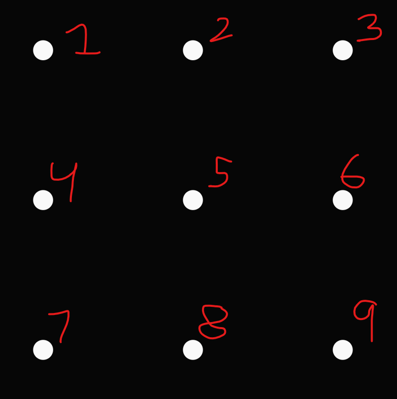
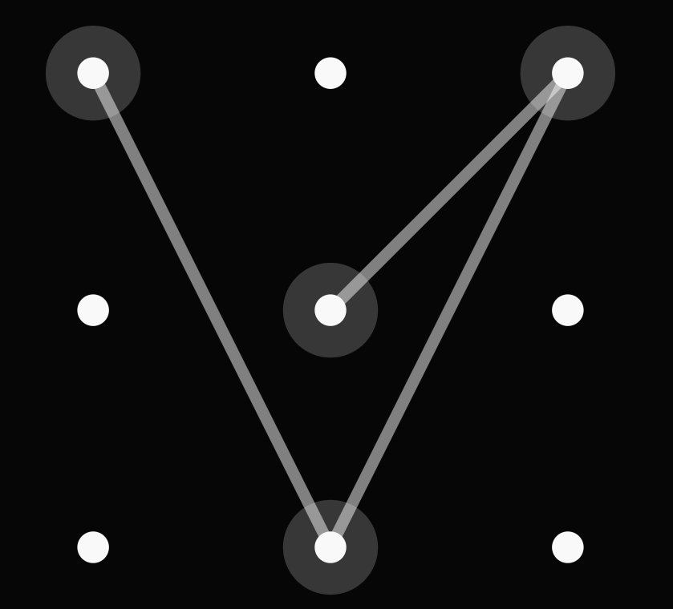
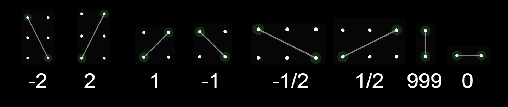
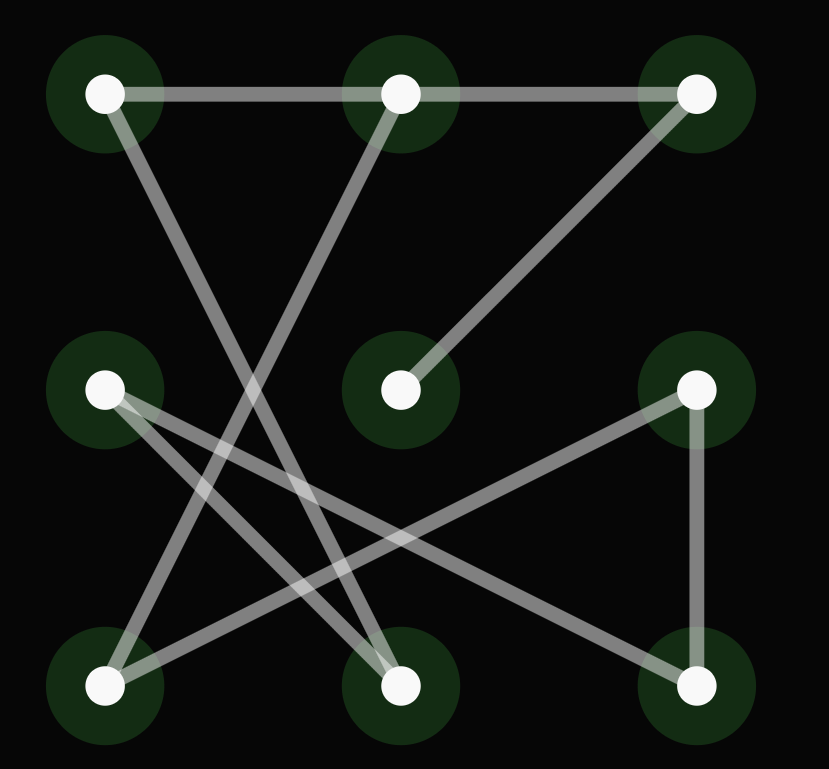
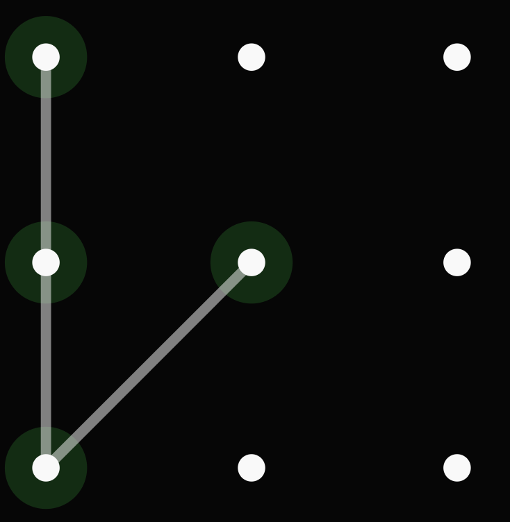
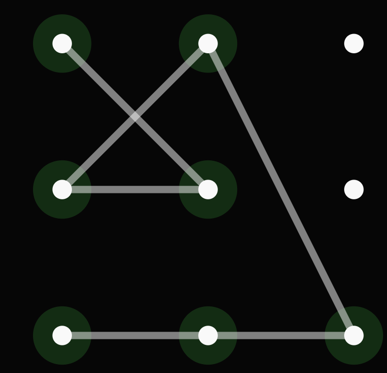

# Complexity of a pattern lock

### Defining a Pattern
***
For the ease of communication, we will number the points of a pattern as such:
 

We define a pattern as a list of numbers, where you connect the points in order. For example, a pattern of [1, 8, 3, 5] would result in this pattern:
 

There are a few constraints on patterns:
- A pattern needs to be atleast 4 points long
- A point cannot be used twice (no cycles or branching)
- An open point cannot be "jumped" over. More formally, if there is a point B between a point A and point C, then there cannot be a direct line from point A to point C unless point B is already used

##### Examples of invalid patterns:
[1, 2, 5]: Pattern is too short
[1, 2, 7, 4, 1]: Pattern cannot use the same point twice
[4, 1, 3, 5, 6]: Line between 1 and 3 cannot be direct with 2 being unused
- It would be valid if 2 was used before the line between 1 and 3, such as this [4, 2, 1, 3, 5, 6]

 

### Features of a Pattern
***
We break the patterns into 2 properties:

- The points
- The lines

#####  Line types 
The points are straight forward, but we have a good deal of variety with the lines. The chart below demonstrates all the line types possible in a 3x3 grid pattern:

The lines are named by their slopes, except the vertical line, whose slope is undefined, but for ease of implementation and communication. It can be any arbitrary number that is not any of the other slopes, and I went with 999.

 

### Measuring the Complexity of a Pattern
***
The complexity of a pattern is determined by the points and the lines. It is the sum of the number of unique points used and unique slopes used. with 9 points and 8 line types, this adds up to 17 being our max complexity. Keeping in mind that a minimum of 4 points need to be used for a pattern gives us 6 as our lowest possible complextity score (4 points, 2 line types).

##### Examples:

| 17 score pattern (max) | 6 score pattern (min) | 11 score pattern |
| --- | --- | --- |
|| | |

 
 
 

# Method to find the complex patterns
The way the complex patterns are found in this code is actually quite inefficient, as we generate all the possible patterns first and then filter them by complexity of 17. This was because I also wanted to create a function to generate all solutions given a custom grid.
 
### Generating
***
To generare all the possible patterns, we used a recursive function `r_sols` to generate all the max length solutions given a starting point. all the smaller length solutions can be found by taking all prefixes of a max length solution. The function generates the solutions by using a modified Depth First Search algorithm. The modified part is that instead of searching all adjacent nodes, it curates a list of all available nodes in order to not break the constraint of jumping over points. 

Essentially, the function looks for all possible next steps, goes there, and repeats the process until all points are used. 

 

### Filtering
***
Once all the solutions are generated, it was filtered to contain solutions with length of 9 (max points) and slopes of 8 different types (max line types). This was simply done by converting the numbers into coordinates that match each point when point 7 is the origin. With the coordinates, slopes of lines were calculated and only solutions of length 9 and 8 line types were added to a new list.

 
 
 

# Animating

You can animate a lock pattern using the `draw_pattern_animation` function in animate.py. It is not very fast and not very beautiful as it uses MatPlotLib to animate, but it is usable and fairly reasonable to just visualize and play around with the patterns
